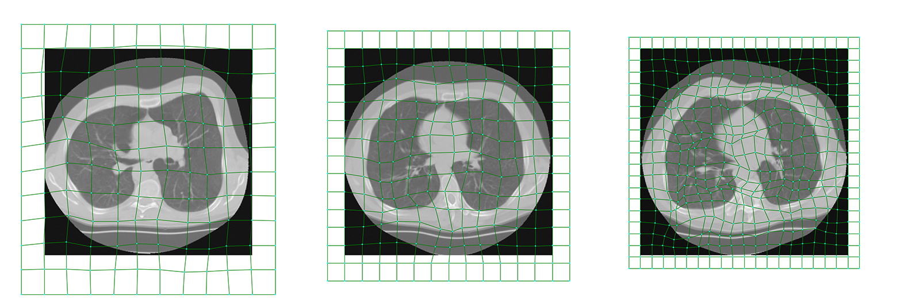
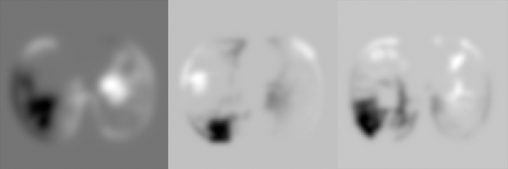
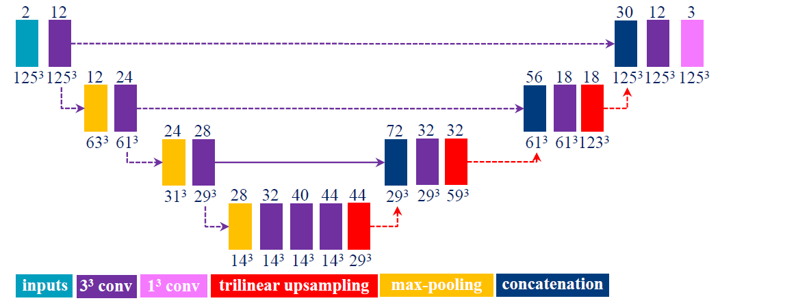

RegNet
==========

## Introduction
In this work we propose a method to solve nonrigid image registration through a learning approach, instead of via iterative optimization of a predefined dissimilarity metric. We design a Convolutional Neural Network (CNN) architecture that, in contrast to all other work, directly estimates the displacement vector field (DVF) from a pair of input images. The proposed RegNet is trained using a large set of artificially generated DVFs, does not explicitly define a dissimilarity metric, and integrates image content at multiple scales to equip the network with contextual information. At testing time nonrigid registration is performed in a single shot, in contrast to current iterative methods.

### Citation
[1] [Hessam Sokooti](https://scholar.google.com/citations?user=cTizuxcAAAAJ), [Bob de Vos](https://scholar.google.nl/citations?user=Q0KDwp8AAAAJ), [Floris Berendsen](https://scholar.google.nl/citations?user=x-_btzsAAAAJ), [Mohsen Ghafoorian](https://scholar.google.nl/citations?user=989WL-wAAAAJ), [Sahar Yousefi](https://scholar.google.nl/citations?user=gOuDXuIAAAAJ),  [Boudewijn P.F. Lelieveldt](https://scholar.google.nl/citations?user=J20kK1oAAAAJ), [Ivana Išgum](https://scholar.google.nl/citations?user=xelGbyIAAAAJ) and [Marius Staring](https://scholar.google.nl/citations?user=pKFkfq4AAAAJ), 2019. [3D Convolutional Neural Networks Image Registration Based on Efficient Supervised Learning from Artificial Deformations](https://arxiv.org/abs/1908.10235). arXiv preprint arXiv:1908.10235.

[2] [Hessam Sokooti](https://scholar.google.com/citations?user=cTizuxcAAAAJ), [Bob de Vos](https://scholar.google.nl/citations?user=Q0KDwp8AAAAJ), [Floris Berendsen](https://scholar.google.nl/citations?user=x-_btzsAAAAJ), [Boudewijn P.F. Lelieveldt](https://scholar.google.nl/citations?user=J20kK1oAAAAJ), [Ivana Išgum](https://scholar.google.nl/citations?user=xelGbyIAAAAJ), and [Marius Staring](https://scholar.google.nl/citations?user=pKFkfq4AAAAJ), 2017, September. [Nonrigid image registration using multi-scale 3D convolutional neural networks](https://elastix.lumc.nl/marius/downloads/2017_c_MICCAIa.pdf). In International Conference on Medical Image Computing and Computer-Assisted Intervention (pp. 232-239). Springer, Cham.

	
## 1. Dependencies
- [Joblib](http://github.com/joblib/joblib) : Running Python functions as pipeline jobs.
- [Matplotlib](https://matplotlib.org/) A plotting library for the Python programming language and its numerical mathematics extension NumPy.
- [NumPy](http://www.numpy.org/) : General purpose array-processing package.
- [SimpleITK](http://www.simpleitk.org/) : Simplified interface to the Insight Toolkit for image registration and segmentation.
- [SciPy](https://www.scipy.org/) : A Python-based ecosystem of open-source software for mathematics, science, and engineering.
- [TensorFlow v1.x](https://www.tensorflow.org/) : TensorFlow helps the tensors flow.
- [xmltodict](https://github.com/martinblech/xmltodict) : Python module that makes working with XML feel like you are working with JSON.
	

## 2. Running RegNet
Run`RegNet3D.py`. Please note that current RegNet only works with 3D images.

### 2.1 Data
All images are read and written by [SimpleITK](http://www.simpleitk.org/). The images are already resampled to an isotropic voxel size of [1, 1, 1] mm.

The images in the training and validation set can be defined in a list of dictionaries: 
```python
# simple example how to load the data:
import functions.setting.setting_utils as su

setting = su.initialize_setting(current_experiment='MyCurrentExperiment', where_to_run='Root')
data_exp_dict = [
    {'data': 'DIR-Lab_4D',           # Data to load. The image addresses can be modified in setting_utils.py
     'deform_exp': '3D_max7_D14_K',  # Synthetic deformation experiment
     'TrainingCNList': [1, 2, 3],    # Case number of images to load (The patient number)
     'TrainingTypeImList': [i for i in range(8)],    # Types images for each case number, for example [baseline, follow-up]
     'TrainingDSmoothList': [i for i in range(14)],  # The synthetic type to load. For instance, ['single_frequency', 'mixed_frequency']
     'ValidationCNList': [1, 2],
     'ValidationTypeImList': [8, 9],
     'ValidationDSmoothList': [0, 5, 10],
     },
    {'data': 'SPREAD',
     'deform_exp': '3D_max7_D14_K',
     'TrainingCNList': [i for i in range(1, 11)],
     'TrainingTypeImList': [0, 1],
     'TrainingDSmoothList': [i for i in range(14)],
     'ValidationCNList': [11, 12],
     'ValidationTypeImList': [0, 1],
     'ValidationDSmoothList': [0, 5, 10],
     },

]

setting = su.load_setting_from_data_dict(setting, data_exp_dict)
original_image_address = su.address_generator(setting, 'Im', data='DIR-Lab_4D', cn=1, type_im=0, stage=1)
print(original_image_address)

im_info_list_training = su.get_im_info_list_from_train_mode(setting, 'Training', load_mode='Single', read_pair_mode='Synthetic', stage=1)
im_info_list_training = im_info_list_training[0:4]
print('\n The first four elements are: ')
print(*im_info_list_training, sep="\n")

for im_info in im_info_list_training:
    im_info_su = {'data': im_info['data'], 'deform_exp': im_info['deform_exp'], 'type_im': im_info['type_im'],
                  'cn': im_info['cn'], 'dsmooth': im_info['dsmooth'], 'stage': im_info['stage'], }
    print(su.address_generator(setting, 'Im', **im_info_su))
    print(su.address_generator(setting, 'DeformedIm', **im_info_su))


```

```
./Data/DIR-Lab/4DCT/mha/case1/case1_T00_RS1.mha

 The first four elements are: 
{'data': 'DIR-Lab_4D', 'type_im': 0, 'cn': 1, 'deform_exp': '3D_max7_D14_K', 'dsmooth': 0, 'deform_method': 'respiratory_motion', 'deform_number': 0, 'stage': 1}
{'data': 'DIR-Lab_4D', 'type_im': 0, 'cn': 1, 'deform_exp': '3D_max7_D14_K', 'dsmooth': 1, 'deform_method': 'respiratory_motion', 'deform_number': 1, 'stage': 1}
{'data': 'DIR-Lab_4D', 'type_im': 0, 'cn': 1, 'deform_exp': '3D_max7_D14_K', 'dsmooth': 2, 'deform_method': 'respiratory_motion', 'deform_number': 2, 'stage': 1}
{'data': 'DIR-Lab_4D', 'type_im': 0, 'cn': 1, 'deform_exp': '3D_max7_D14_K', 'dsmooth': 3, 'deform_method': 'respiratory_motion', 'deform_number': 3, 'stage': 1}
./Data/DIR-Lab/4DCT/mha/case1/case1_T00_RS1.mha
./Elastix/Artificial_Generation/3D_max7_D14_K/DIR-Lab_4D/T00/case1/Dsmooth0/respiratory_motion_D0/DeformedImage.mha
./Elastix/Artificial_Generation/3D_max7_D14_K/DIR-Lab_4D/T00/case1/Dsmooth0/DNext1/NextIm.mha
./Elastix/Artificial_Generation/3D_max7_D14_K/DIR-Lab_4D/T00/case1/Dsmooth1/respiratory_motion_D1/DeformedImage.mha
./Elastix/Artificial_Generation/3D_max7_D14_K/DIR-Lab_4D/T00/case1/Dsmooth0/DNext2/NextIm.mha
./Elastix/Artificial_Generation/3D_max7_D14_K/DIR-Lab_4D/T00/case1/Dsmooth2/respiratory_motion_D2/DeformedImage.mha
./Elastix/Artificial_Generation/3D_max7_D14_K/DIR-Lab_4D/T00/case1/Dsmooth0/DNext3/NextIm.mha
./Elastix/Artificial_Generation/3D_max7_D14_K/DIR-Lab_4D/T00/case1/Dsmooth3/respiratory_motion_D3/DeformedImage.mha
```

#### `'data'`: 
The details of `'data'` should be written in the `setting.setting_utils.py`. The general setting of each `'data'` should be defined in 
`load_data_setting(selected_data)` like the extension, total number of types and default pixel value. The global data folder (`setting['DataFolder']`) can be defined in `root_address_generator(where_to_run='Auto')`. 

The details of the image address can be defined in `setting.setting_utils.address_generator()` after the line `if data == 'YourOwnData':`. For example you can take a look at the line 370: `if data == 'DIR-Lab_4D':`. The orginal images are defined with `requested_address= 'OriginalIm'`. To test the reading function, you can run the above script and check the `original_image_address`.


#### `'deform_exp', 'TrainingDSmoothList'`: 
check section 2.2.4 Setting of generating synthetic DVFs

#### `'TrainingCNList', 'TrainingTypeImList'`: 
`'TrainingCNList'` indicates the Case Numbers (CN) that you want to use for training. Usually each cn refers to a specific patient. `'TrainingTypeImList'` indicates which types of the available images for each patient you want to load. For example in the SPREAD data, two types are available: baseline and follow-up. In the DIR-Lab_4D data, for each patient 10 images are available from the maximum inhale to maximum exhale phase.

### 2.2 Setting of generating synthetic DVFs
Four categories of synthetic DVF are available in the software: zero, single frequency, mixed frequency, respiratory motion
#### 2.2.1 Zero `'zero'`
#### 2.2.2 Single frequency `'single_frequency'`
For generating single-frequency DVF, we proposed the following algorithm:
1. Initialize a B-spline grid points with a grid spacing of `deform_exp_setting['SingleFrequency_BSplineGridSpacing']`.
2. Perturb the gird points in a smooth and random fashion.
3. Interpolate to get the DVF.
4. Normalize the DVF linearly, if it is out of the range `[-deform_exp_setting['MaxDeform'], +deform_exp_setting['MaxDeform']]`.
By varying the spacing, different spatial frequencies are generated.

<p align="center">Figure 1: Single Frequency: B-spline grid spacing are 40, 30 and 20 mm from left to right.</p>

#### 2.2.3 Mixed frequency `'mixed_frequency'`

The steps for the mixed-frequency category is as follows:
1. Extract edges with Canny edge detection method.
2. Copy the binary image three times to get a vector of 3D image with the length of three.
3. Set some voxels to be zero randomly for each image. 
4. Dilate the binary image for `deform_exp_setting['MixedFrequency_Np']` iteration by using a random structure element for each image.
5. Fill the binary dilated image with a DVF generated from the single-frequency method.
6. Smooth the DVF with a Gaussian kernel with standard deviation of `deform_exp_setting['MixedFrequency_SigmaRange']`. The sigma is relatively small which leads to a higher spatial frequency in comparison with the filled DVF.
By varying the sigma value and `deform_exp_setting['MixedFrequency_BSplineGridSpacing']` in the filled DVF, different spatial frequencies will be mixed together.


<p align="center">Figure 2: Mixed Frequency.</p>

#### 2.2.4 `'deform_exp', 'TrainingDSmoothList'`
`'deform_exp'` is defined in the `setting.artificial_generation_setting.py`. For example you can use multiple types of single frequency and mixed frequency:
```python
def_setting['DeformMethods'] = ['respiratory_motion', 'respiratory_motion', 'respiratory_motion', 'respiratory_motion',
                                 'single_frequency', 'single_frequency', 'single_frequency', 'single_frequency', 'single_frequency',
                                 'mixed_frequency', 'mixed_frequency', 'mixed_frequency', 'mixed_frequency',
                                 'zero']
```
The above setting is at the generation time. However, you might not want to load all of them at the reading time.

`'ValidationDSmoothList': [2, 4, 8]`: This means that you want to load translation type2, smoothBspline type1 and dilatedEdgeSmooth type 2.


### 2.3 Network
The proposed networks are given in Figure 3, 4, 5.

<p align="center">Figure 3: unet1 (U-Net).</p>

")
<p align="center">Figure 4: decimation4 (Multi-view).</p>

")
<p align="center">Figure 5: crop4 (U-Net advanced).</p>


### 2.4 Software Architecture

<p align="center">Figure 6: Software Architecture.</p>

#### 2.4.1 Memory efficiency
It is not efficient (or possible)  to load all images with their DVFs to the memory. A DVF is three times bigger than its corresponding image with the type of float32. Alternatively, this software loads a chunk of images.  The number of images per chunk can be chosen by the parameter: `setting['NetworkTraining']['NumberOfImagesPerChunk']`
```python
setting['NetworkTraining']['NumberOfImagesPerChunk'] = 16  # Number of images that I would like to load in RAM
setting['NetworkTraining']['SamplesPerImage'] = 50
setting['NetworkTraining']['BatchSize'] = 15
setting['NetworkTraining']['MaxQueueSize'] = 20
```

#### 2.4.2 Parallel Computing
We used `threading` in order to read patches in parallel with training the network. The class `functions.reading.chunk_image.Images` is defined to read images with threading.


