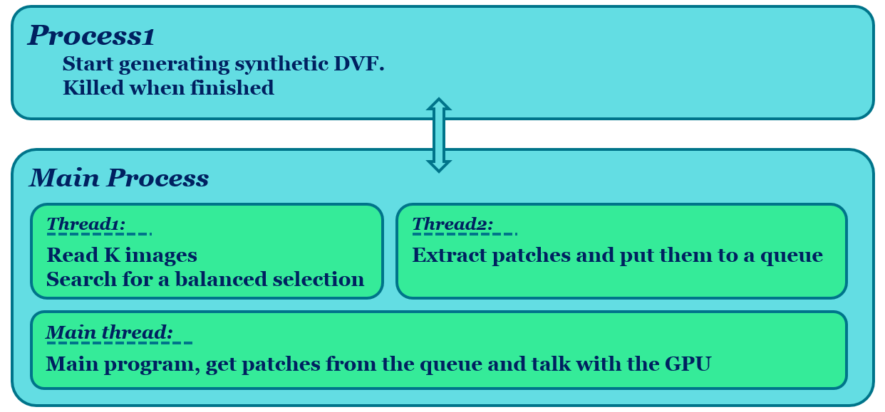

RegNet
==========

`The documentation of this version will be updated soon...`

## Introduction
In this paper we propose a method to solve nonrigid image registration through a learning approach, instead of via iterative optimization of a predefined dissimilarity metric. We design a Convolutional Neural Network (CNN) architecture that, in contrast to all other work, directly estimates the displacement vector field (DVF) from a pair of input images. The proposed RegNet is trained using a large set of artificially generated DVFs, does not explicitly define a dissimilarity metric, and integrates image content at multiple scales to equip the network with contextual information. At testing time nonrigid registration is performed in a single shot, in contrast to current iterative methods.

### Citation

[1] Sokooti, H., de Vos, B., Berendsen, F., Lelieveldt, B.P., Išgum, I. and Staring, M., 2017, September. Nonrigid image registration using multi-scale 3D convolutional neural networks. In International Conference on Medical Image Computing and Computer-Assisted Intervention (pp. 232-239). Springer, Cham.

	
## 1. Dependencies
- [Joblib](http://github.com/joblib/joblib) : Running Python functions as pipeline jobs.
- [Matplotlib](https://matplotlib.org/) A plotting library for the Python programming language and its numerical mathematics extension NumPy.
- [numpy](http://www.numpy.org/) : General purpose array-processing package.
- [SimpleITK](http://www.simpleitk.org/) : Simplified interface to the Insight Toolkit for image registration and segmentation.
- [SciPy](https://www.scipy.org/) : A Python-based ecosystem of open-source software for mathematics, science, and engineering.
- [TensorFlow](https://www.tensorflow.org/) : TensorFlow helps the tensors flow.
- [xmltodict](https://github.com/martinblech/xmltodict) : Python module that makes working with XML feel like you are working with JSON.


	

## 2. Running RegNet
Run either `RegNet2D_MICCAI.py` or `RegNet3D_MICCAI.py`. Please note that current RegNet only works with 3D images and the script `RegNet2D_MICCAI.py` extracts 2D slices from a 3D image.

### 2.1 Data
Images are read and written by [SimpleITK](http://www.simpleitk.org/).  Check the documentation for the image type. Images are already resampled to an isotropic voxel size of [1, 1, 1] mm.


This software considers both fixed and moving images are available in the database. The images in the training, validation set can be defined in a list of dictionaries: 
```
# simple example how to load the data:

setting = su.initialize_setting(current_experiment='MyCurrentExperiment')

data_exp_dict = [{'data': 'SPREAD',                              # Data to load. The image addresses can be modified in setting_utils.py
		  'deform_exp': '3D_max7_D9',                    # Synthetic deformation experiment
		  'TrainingCNList': [i for i in range(1, 11)],   # Case number of images to load (The patient number)
		  'TrainingTypeImList': [0, 1],                  # Types images for each case number, for example [baseline, follow-up]
		  'TrainingDSmoothList': [i for i in range(9)],  # The synthetic type to load. For instance, ['translation', 'bsplineSmooth']
		  'ValidationCNList': [11, 12],
		  'ValidationTypeImList': [0, 1],
		  'ValidationDSmoothList': [2, 4, 8],
		  },
		 {'data': 'DIR-Lab_4D',
		  'deform_exp': '3D_max7_D9',
		  'TrainingCNList': [1, 2, 3],
		  'TrainingTypeImList': [i for i in range(8)],
		  'TrainingDSmoothList': [i for i in range(9)],
		  'ValidationCNList': [1, 2],
		  'ValidationTypeImList': [8, 9],
		  'ValidationDSmoothList': [2, 4, 8],
		  }
		 ]

setting = su.load_setting_from_data_dict(setting, data_exp_dict)
original_image_address = su.address_generator(setting, 'originalIm', data='DIR-Lab_4D', cn=1, type_im=0, stage=1)
print(original_image_address)

```
#### `'data'`: 
The details of `'data'` should be written in the `setting_utils.py`. The general setting of each `'data'` should be defined in 
`load_data_setting(selected_data)` like the extension, total number of types and default pixel value. The global data folder (`setting['DataFolder']`) can be defined in `root_address_generator(where_to_run='Auto')`. The details of the image address can be defined in `address_generator()` after the line `if data == 'YourOwnData':`. For example you can take a look at the line 381: `if data == 'DIR-Lab_4D':`. The orginal images are defined with `requested_address= 'originalIm'`. To test the reading function, you can run the above script. 

#### `'deform_exp', 'TrainingDSmoothList'`: 
check section 2.2 Setting of generating synthetic DVFs

#### `'TrainingCNList', 'TrainingTypeImList'`: 
`'TrainingCNList'` indicates the Case Numbers (CN) that you want to use for training. Usually each cn refers to a specific patient. `'TrainingTypeImList'` indicates which types of the available images for each patient you want to load. For example in the SPREAD data, two types are available: baseline and follow-up. In the DIR-Lab_4D data, for each patient 10 images are available from the maximum inhale to maximum exhale phase.

### 2.2 Setting of generating synthetic DVFs
Three categories of synthetic DVF are available in the software: translation, single frequency, mixed frequency
#### 2.2.1 Zero Frequency `'translation'`
#### 2.2.2 Single frequency `'smoothBspline'`
For generating single-frequency DVF, we proposed the following algorithm:
1. Initialize a B-spline grid points with a grid spacing of $s$.
2. Perturb the gird points in a smooth and random fashion.
3. Interpolate to get the DVF.
4. Normalize the DVF linearly, if it is out of the range $[-\theta, +\theta]$.
By varying the spacing, different spatial frequencies are generated.
#### 2.2.2 Mixed frequency `'dilatedEdge'`


### 2.3 Network
The proposed network is given in Figure 1.

<p align="center">Figure 1: RegNet design.</p>

### 2.3 Setting of generating synthetic DVFs

Synthetic DVFs are generated with varying spatial frequency and amplitude, aiming to represent the range of displacements that can be seen in real images. The parameter `Setting['sigmaB']` controls the spatial frequencies of the synthetic DVFs. (See Figure 2)

    Setting['DLFolder'] = '/hsokooti/DL/'    
    Setting['deformName'] = 'LungExp2D_1'
    Setting['Dim'] = '2D'               # '2D' or '3D'. Please note that in 2D setting, we still have a 3D DVF with zero values for the third direction
    Setting['DistanceDeform'] = 40      # The minimum distance between two random peaks
    Setting['DistanceArea'] = 20        # The area that is inculeded in the training algorithm
    Setting['sigmaNL'] = 1              # For adding noise for the next fixed image. This noise should be small otherwise we would ruin the SNR.
    Setting['Border'] = 33              # No peak would be in range of [0,Border) and [ImSize-Border, ImSize)
    Setting['sigmaN'] = 5               # Sigma for adding noise after deformation
    Setting['MaxDeform'] = [20, 15, 15] # The maximum amplitude of deformations
    Setting['sigmaB'] = [35, 25, 20]    # For blurring deformaion peak
    Setting['Np'] = [100, 100, 100]     # Number of random peaks

The above setting makes the following deformed images: (3 deformed images of the fixed image and 3 deformed images of the moving image)
```
Setting['DLFolder']/LungExp2D_1F/ExpLung1/Dsmooth0/D0/DeformedImage.mha
Setting['DLFolder']/LungExp2D_1F/ExpLung1/Dsmooth0/D0/DeformedDVF.mha

Setting['DLFolder']/LungExp2D_1F/ExpLung1/Dsmooth0/D1/DeformedImage.mha
Setting['DLFolder']/LungExp2D_1F/ExpLung1/Dsmooth0/D1/DeformedDVF.mha

Setting['DLFolder']/LungExp2D_1F/ExpLung1/Dsmooth0/D2/DeformedImage.mha
Setting['DLFolder']/LungExp2D_1F/ExpLung1/Dsmooth0/D2/DeformedDVF.mha

Setting['DLFolder']/LungExp2D_1M/ExpLung1/Dsmooth0/D0/DeformedImage.mha
Setting['DLFolder']/LungExp2D_1M/ExpLung1/Dsmooth0/D0/DeformedDVF.mha

Setting['DLFolder']/LungExp2D_1M/ExpLung1/Dsmooth0/D1/DeformedImage.mha
Setting['DLFolder']/LungExp2D_1M/ExpLung1/Dsmooth0/D1/DeformedDVF.mha

Setting['DLFolder']/LungExp2D_1M/ExpLung1/Dsmooth0/D2/DeformedImage.mha
Setting['DLFolder']/LungExp2D_1M/ExpLung1/Dsmooth0/D2/DeformedDVF.mha
...
```


<p align="center">Figure 2: Heat maps of the magnitude of DVFs used for training RegNet (left) Low frequency, (middle) Medium frequency, (right) High frequency.</p>

### 2.4 Setting of reading synthetic DVFs

The software extracts patches from images and their DVF in a random fashion. However, it is possible to control it with some settings.  By the use of `Setting['classBalanced']`, training data can be balanced with respect to the values of DVF and at the same time the maximum value of DVFs  is set.

    Setting['Resolution'] = 'multi'         # 'single' or 'multi' resolution. In multiresolution, the downsampled patch is involved.
    Setting['deformMethod'] = [0, 1, 2]     # 0: low freq, 1: medium freq, 2: high freq.
    Setting['classBalanced'] = [1.5, 4, 8]  # Use these threshold values to balance the number of data in each category. for instance [a,b] implies classes [0,a), [a,b). Numbers are in mm
    Setting['K'] = 65                       # Margin from the border to select random patches
    Setting['ParallelSearch'] = True        # Using np.where in parallel with [number of cores - 2] in order to make balanced data. This is done with joblib library
    Setting['R'] = 14                       # Radius of normal resolution patch size. Total size is (2*R +1)
    Setting['Rlow'] = 26                    # Radius of low resolution patch size. Total size is (Rlow +1). Selected patch size: center-Rlow : center+Rlow : 2
    Setting['Ry'] = 0                       # Radius of output. Total size is (2*Ry +1)

#### 2.4.1 Memory efficiency
It is not efficient (/possible)  to load all images with their DVFs to the memory. A DVF is three times bigger than its corresponding image with type of float32. Alternatively, this software loads a chunk of images.  The number of images per chunk can be chosen by the parameter: `numberOfImagesPerChunk`
```
numberOfImagesPerChunk = 5          # Number of images that I would like to load in RAM
samplesPerImage = 10000
```

#### 2.4.2 Software Architecture
We used `threading` in order to read patches in parallel with training the network. We define the `RegNet.Patches` class to read in a normal way and the `RegNetThread.PatchesThread` class to read patches with threading.

<p align="center">Figure 3: Software Architecture.</p>


